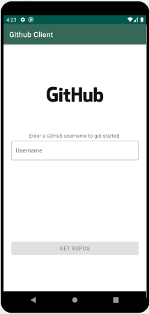
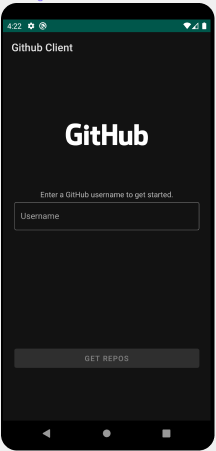
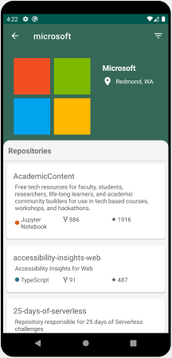
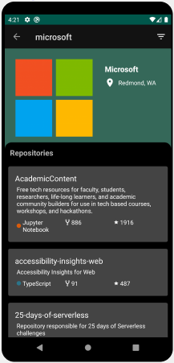

[](https://github.com/gerin98/androidGitClient/blob/master/LICENSE) [](https://github.com/gerin98/androidGitClient/releases)

# Android Git Client
Search and Browse through GitHub repos with this helpful android app. Powered by the GitHub REST API, you can find any public repo hosted on GitHub!

   

## Table of Contents
**[1. Main Features](#main-features-bulb)**<br>
**[2. Getting Started](#getting-started-rocket)**<br>
**[3. Api](#api-newspaper)**<br>
**[4. Tech Stack](#tech-stack-hammer_and_wrench)**<br>
**[5. License](#license)**<br>

## Main Features :bulb:

#### Dark Mode :first_quarter_moon:
Supports both light and dark themes.

#### Search :mag:
Search by GitHub username to obtain all of their public repos.

#### Sorting :open_file_folder:
Sort results by alphabetical, most starred or most forked.

## Getting Started :rocket:
Clone this repo to play with it yourself. 
```
git clone https://github.com/gerin98/androidGitClient.git
```
You can also download the APK directly [here](https://github.com/gerin98/androidGitClient/releases).

## Api :newspaper:
This project makes use of the [Github's API](https://docs.github.com/en/rest) to query for users and repos. 

## Tech Stack :hammer_and_wrench:
- Language
  - [Kotlin](https://kotlinlang.org/) - First class and official programming language for Android development.
- Architecture
  - [MVVM & Repository pattern](https://developer.android.com/jetpack/docs/guide#overview) - separate ui logic from business logic.
  - [LiveData](https://developer.android.com/topic/libraries/architecture/livedata) - an observable lifecycle-aware data holder class.
  - [RxJava](https://github.com/ReactiveX/RxJava) - a library for composing asynchronous and event-based programs by using observable sequences.
  - [ViewBinding](https://developer.android.com/topic/libraries/view-binding) - easily write code that interacts with views.
- Network
  - [Retrofit](https://square.github.io/retrofit/) - A type-safe HTTP client for Android and Java.
- UI
  - [Databinding](https://developer.android.com/topic/libraries/data-binding) - bind UI components in your layouts to data sources in your app.
  - [Material Design](https://material.io/design) - a visual language that synthesizes the classic principles of good design with the innovation of technology and science.
  - [Icons](https://material.io/resources/icons/?style=baseline) - delightful, beautifully crafted symbols for common actions and items.
- Image loading
  - [Glide](https://github.com/bumptech/glide) - An image loading and caching library for Android focused on smooth scrolling.

## License
```
MIT License

Copyright (c) 2020 Gerin Amalaraj

Permission is hereby granted, free of charge, to any person obtaining a copy
of this software and associated documentation files (the "Software"), to deal
in the Software without restriction, including without limitation the rights
to use, copy, modify, merge, publish, distribute, sublicense, and/or sell
copies of the Software, and to permit persons to whom the Software is
furnished to do so, subject to the following conditions:

The above copyright notice and this permission notice shall be included in all
copies or substantial portions of the Software.

THE SOFTWARE IS PROVIDED "AS IS", WITHOUT WARRANTY OF ANY KIND, EXPRESS OR
IMPLIED, INCLUDING BUT NOT LIMITED TO THE WARRANTIES OF MERCHANTABILITY,
FITNESS FOR A PARTICULAR PURPOSE AND NONINFRINGEMENT. IN NO EVENT SHALL THE
AUTHORS OR COPYRIGHT HOLDERS BE LIABLE FOR ANY CLAIM, DAMAGES OR OTHER
LIABILITY, WHETHER IN AN ACTION OF CONTRACT, TORT OR OTHERWISE, ARISING FROM,
OUT OF OR IN CONNECTION WITH THE SOFTWARE OR THE USE OR OTHER DEALINGS IN THE
SOFTWARE.
```
